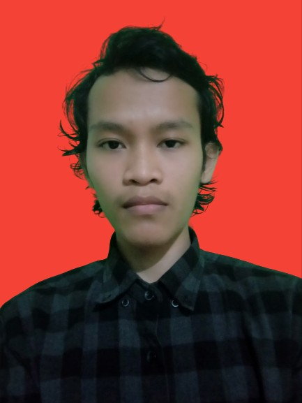

 

<h1 align="center">TUGAS PEMBUATAN APLIKASI DENGAN PENERAPAN <i>OBJECT ORIENTED PROGRAMMING</i></h1>
 

**Daftar Isi:**

- [My Profil](#profil "panggil aja ilman")
- [Proyek Aplikasi](#proyek-aplikasi "aplikasi sederhana")

## PROFIL

**Nama :** Tri Ilman Almunawarah Fattah 
**NIM :** 32602000101 
**Fakultas :** Teknologi Industri 
**Prodi :** Teknik Informatika 
**Kelas Asal :** Teknik Informatika C 
**Angkata :** 2020
 
  
 
## PROYEK APLIKASI

1. [Body Mass Index](body_mass_index)
