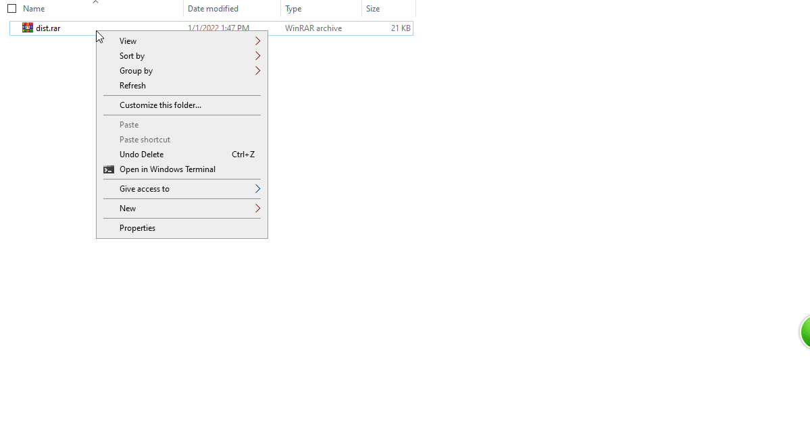
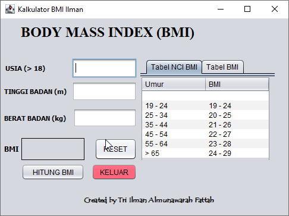

<h1 align="center">Cara Menggunakan Kalkulator BMI</h1>

 

1. Pertama, _download_ file **rar** di folder **Aplikasi** atau [di sini](Aplikasi/dist.rar).
2. Setelah men-_download_ lakukan seperti apa yang ditunjukkan di bawah ini. Gunakan file `.bat` jika file `.jar` tidak dapat dijalankan.
 
||
|---|

3. Setelah itu anda bisa menggunakan aplikasi BMI seperti tutorial di bawah ini.

||
|---|

  > **Keterangan :** Perlu diketahui bahwa cara kerja aplikasi kalkulator ini adalah dengan penyesuaian kondisi dari BMI itu sendiri dengan rumus `BMI = massa/tinggi^2`, dimana _massa_ = kg, dan tinggi = meter dan Umur atau usia. Setiap BMI yang keluar akan menampilkan 3 warna. untuk warna **kuning** menunjukkan berat badan yang agak berat atau agak ringan (belum tahap Obesitas. Lebih jelasnya lihat tabel pada aplikasi). untuk warna **hijau** menunjukkan berat badan normal dan untuk warna **merah** untuk obesitas akut atau kekurangan gizi (terlalu kurus).
