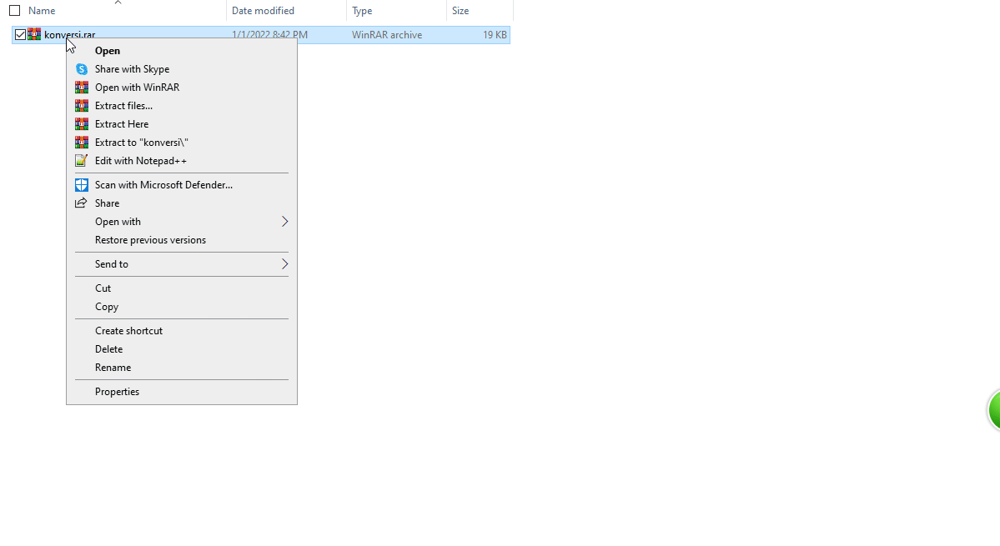

<h1 align="center">Aplikasi Desktop untuk Konversi Suhu (<i>celcius - fahrenheit</i> dan <i>fahrenheit - celcius</i>)</h1>
 

Cara menggunakan Aplikasi :
1. _Download_ file `rar` di folder **Aplikasi** atau [di sini](Aplikasi/konversi.rar)
2. Selanjutnya ikuti tutorial di bawah ini.

